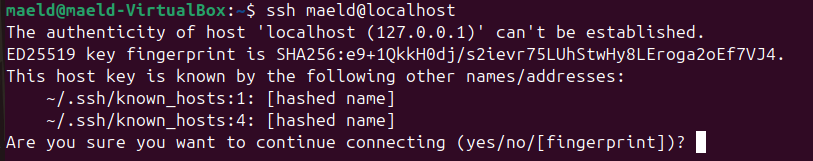

# TP 1 – Introduction à Linux et Sécurité du Système

## Partie 1 — Installation et vérification du service SSH

### J'ai utiliser la commande ```sudo systemctl status ssh``` pour vérifier si le status de ssh


## Partie 2 — Génération et validation des clés

### Pour générer une paire de clés j'ai utiliser la commande ```ssh-keygen```


### Puis j'ai voulu afficher ma clé public pour la connaitre avec la commande ```cat /home/maeld/.ssh/id_ed25519.pub```

### Après j'ai copier la clé public dans le fichier authorized_keys avec ```cat ~/.ssh/id_ed25519.pub >> ~/.ssh/authorized_keys```

### Et ensuite on affiche le contenu du fichier authorized_keys avec ```cat ~/.ssh/authorized_keys```


### Pour vérifier l'empreinte de la clé hôte j'ai fait ```ssh maeld@localhost```et j'ai obtenu mon fingerprint 

