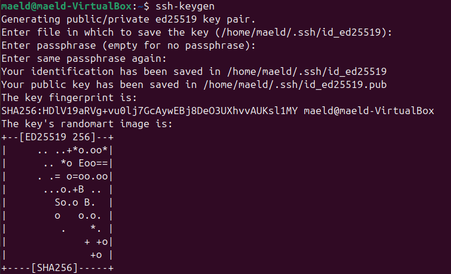

# TP 1 – Introduction à Linux et Sécurité du Système

## Partie 1 — Installation et vérification du service SSH

### J'ai utiliser la commande ```sudo systemctl status ssh``` pour vérifier si le status de ssh


## Partie 2 — Génération et validation des clés

### Pour générer une paire de clés j'ai utiliser la commande ```ssh-keygen```



### Puis j'ai voulu afficher ma clé public pour la connaitre avec la commande ```cat /home/maeld/.ssh/id_ed25519.pub```

### Après j'ai copier la clé public dans le fichier authorized_keys avec ```cat ~/.ssh/id_ed25519.pub >> ~/.ssh/authorized_keys```

### Et ensuite on affiche le contenu du fichier authorized_keys avec ```cat ~/.ssh/authorized_keys```


### Pour vérifier l'empreinte de la clé hôte j'ai fait ```ssh maeld@localhost```et j'ai obtenu mon fingerprint 


## Partie 3

## Définir un port non standard pour SSH

### Pour définir un port non standard on fait la commande ```sudo nano /etc/ssh/sshd_config``` on cherche la ligne avec le #Port 22 et on le modifie, moi j'ai mis le #Port 2222

### On sauvegarde le nano puis on redémarre le serveur SSH avec ```sudo systemctl restart ssh```

### J'ai utiliser la commande ```sudo ss -tnlp | grep ssh``` pour voir le fichier où le port est changé


## Interdire la connexion directe du compte root

### On va devoir rouvrir le ```sudo nano /etc/ssh/sshd_config``` et rajouter une ligne contenant "PermitRootLogin no"


### On sauvegarde et relance ssh avec ```sudo systemctl restart ssh```

## Restreindre l’accès à une liste d’utilisateurs autorisés

### On ouvre encore une fois le nano ```sudo nano /etc/ssh/sshd_config```

### J'ai rajouter la ligne "AllowUsers maeld" 


### Sauvegarder et redémarrez ssh ```sudo systemctl restart ssh```

## Désactiver l’authentification par mot de passe ; n’autoriser que l’authentification par clé publique

### Encore une fois, on ouvre le nano ```sudo nano /etc/ssh/sshd_config```

### On écrit la ligne "PasswordAuthentication no"


### Sauvegarder et redémarrez ssh ```sudo systemctl restart ssh```

## Réduire la fenêtre d’authentification et le nombre maximum de tentatives

### On ouvre le nano ```sudo nano /etc/ssh/sshd_config```

### On ajoute les lignes "MaxAuthTries 5" pour limiter a 5 tentative maximum et "LoginGraceTime 30s" pour limiter la fenêtre de saisie à 30 secondes


### Sauvegarder et redémarrez ssh ```sudo systemctl restart ssh```

##

## Pare-feu et ouverture du port SSH

### J'ai trouver le pare-feux ufw qui avais l'air plutôt simple et efficace sur Ubuntu

### Donc j'ai commencer avec ```sudo ufw enable``` 

### Ensuite on refuse toutes les connexions qui entre par défaut avec ```sudo ufw default deny incoming```

### Puis on autorise les connexions sortantes avec ```sudo ufw default allow outgoing```

### Après j'ai autoriser uniquement le port 2222 que j'ai choisis plus tôt avec ```sudo ufw allow 2222/tcp```

### Et j'ai vérifier l'état du pare-feu en fesant ```sudo ufw status verbose```

